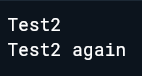
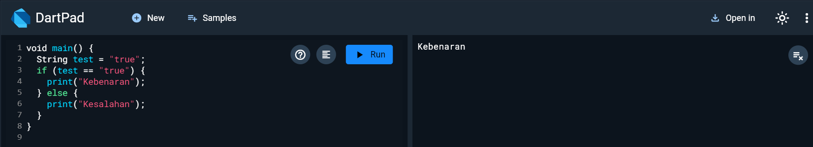
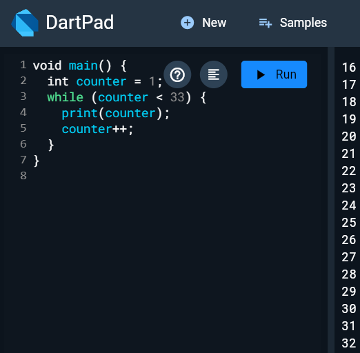
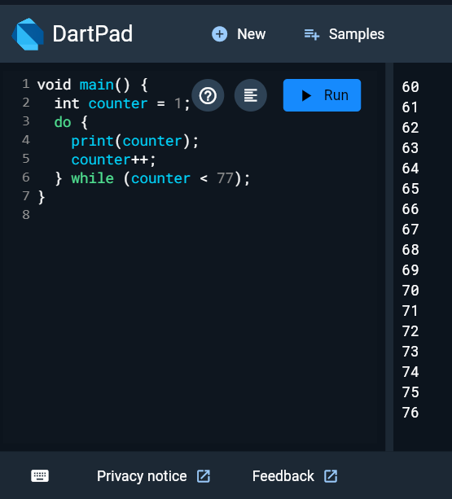
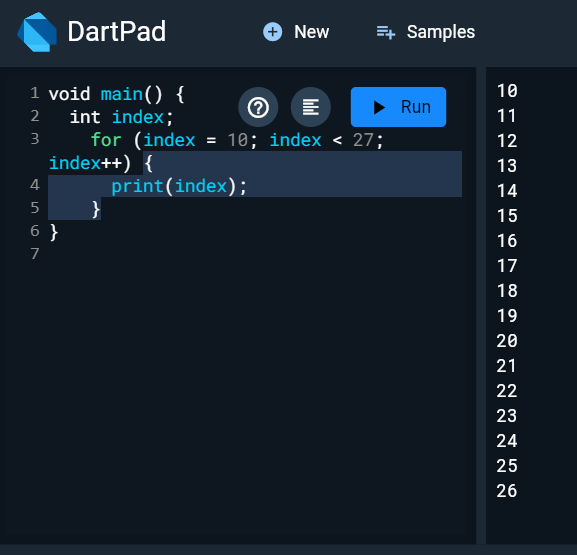
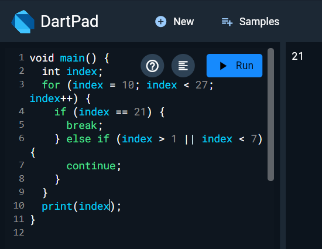

# Laporan Jobsheet 3
# Pengantar Bahasa Pemrograman Dart - Bagian 2
## Praktikum 1: Menerapkan Control Flows ("if/else")
### Langkah 1: 
Ketik atau salin kode program berikut ke dalam fungsi main().
``` void main() {
  String test = "test2";
  if (test == "test1") {
    print("Test1");
  } else if (test == "test2") {
    print("Test2");
  } else {
    print("Something else");
  }

    if (test == "test2") print("Test2 again");
}
```
Output



### Langkah 2:
Silakan coba eksekusi (Run) kode pada langkah 1 tersebut. Apa yang terjadi? Jelaskan!

> Output menghasilkan Test2 dan Test2 again karena kondisi masuk ke elseif pada pengecekan pertama dan true pada pengecekan kedua.

### Langkah 3: 
Tambahkan kode program berikut, lalu coba eksekusi (Run) kode Anda.

``` String test = "true";
if (test) {
   print("Kebenaran");
} 
```
Apa yang terjadi ? Jika terjadi error, silakan perbaiki namun tetap menggunakan if/else.

Terjadi error, perbaikan kode:
```String test = "true";
if (test == "true") {
    print("Kebenaran");
} else {
    print("Kesalahan");
}
```
Output




## Praktikum 2: Menerapkan Perulangan "while" dan "do-while"

### Langkah 1:
Ketik atau salin kode program berikut ke dalam fungsi main().
```
while (counter < 33) {
  print(counter);
  counter++;
}
```
### Langkah 2: 
Silakan coba eksekusi (Run) kode pada langkah 1 tersebut. Apa yang terjadi? Jelaskan! Lalu perbaiki jika terjadi error.

> Terjadi error karena variaebl counter belum terinisialisasi
Perbaikan kode:

```
int counter = 1;
while (counter < 33) {
    print(counter);
    counter++;
}
```
Output



### Langkah 3:
Tambahkan kode program berikut, lalu coba eksekusi (Run) kode Anda.
```
do {
  print(counter);
  counter++;
} while (counter < 77);
```
Apa yang terjadi ? Jika terjadi error, silakan perbaiki namun tetap menggunakan do-while.

> Terjadi error karena variabel counter belum diinisialisasi
Perbaikan kode:
```
int counter = 1;
do {
    print(counter);
    counter++;
} while (counter < 77);
```
Output



## Praktikum 3: Menerapkan Perulangan "for" dan "break-continue"

### Langkah 1:
Ketik atau salin kode program berikut ke dalam fungsi main().
```
for (Index = 10; index < 27; index) {
  print(Index);
}
```
### Langkah 2:
Silakan coba eksekusi (Run) kode pada langkah 1 tersebut. Apa yang terjadi? Jelaskan! Lalu perbaiki jika terjadi error.

> Terdapat error karena variabel index belum diinisialisasi, dan ada ketidakkonsistenan dalam penulisan variabel index
Perbaikan kode:
```
int index;
for (index = 10; index < 27; index++) {
    print(index);
}
```
Output


### Langkah 3:
Tambahkan kode program berikut di dalam for-loop, lalu coba eksekusi (Run) kode Anda.
```
If (Index == 21) break;
Else If (index > 1 || index < 7) continue;
print(index);
```
Apa yang terjadi ? Jika terjadi error, silakan perbaiki namun tetap menggunakan for dan break-continue.

>Terjadi error karena penggunaan If dan Else If dengan huruf kapital, dan Index yang tidak konsisten dengan index
Perbaikan kode
```
void main() {
  int index;
  for (index = 10; index < 27; index++) {
    if (index == 21) {
      break;
    } else if (index > 1 || index < 7) {
      continue;
    }
  }
  print('$index');
}
```
Output



