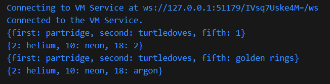
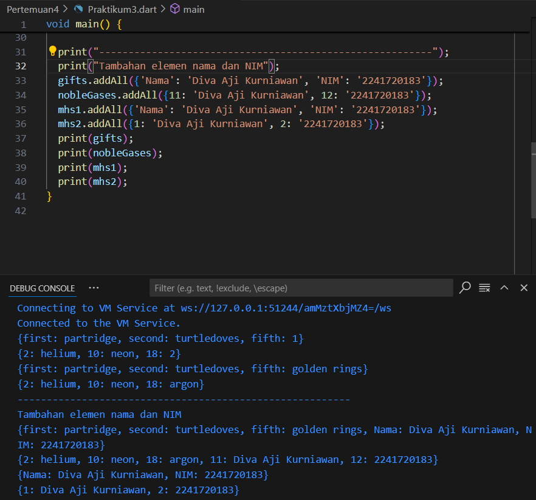
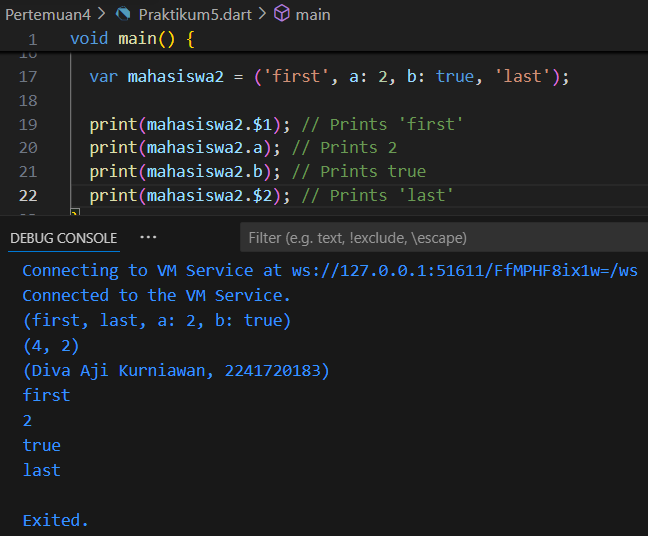

# Laporan Jobsheet 4
# Pengantar Bahasa Pemrograman Dart - Bagian 3
## Praktikum 1: Eksperimen Tipe Data List
### Langkah 1: 
Ketik atau salin kode program berikut ke dalam void main().
```var list = [1, 2, 3];
assert(list.length == 3);
assert(list[1] == 2);
print(list.length);
print(list[1]);

list[1] = 1;
assert(list[1] == 1);
print(list[1]);
```
### Langkah 2: 
Silakan coba eksekusi (Run) kode pada langkah 1 tersebut. Apa yang terjadi? Jelaskan!

Output:


> Program menghasilkan output 3,2,1 karena 3 merupakan hasil print dari panjang list yaitu 3, 2 berasalah dari isi array list index ke-1 yaitu 2, dan 1 berasal dari list index ke-1 yang telah diganti menjadi angka 1.

### Langkah 3:
Ubah kode pada langkah 1 menjadi variabel final yang mempunyai index = 5 dengan default value = null. Isilah nama dan NIM Anda pada elemen index ke-1 dan ke-2. Lalu print dan capture hasilnya.

Kode dan output:


> Dengan mengisi array list yang memiliki index 5 dengan default null dan set pada index ke-1 nama dan index ke-2 NIM, maka dalam mengakses array dapat menguakan print nama array dan index yang ingin di print.

## Praktikum 2: Eksperimen Tipe Data Set

### Langkah 1:
Ketik atau salin kode program berikut ke dalam fungsi main().
```
var halogens = {'fluorine', 'chlorine', 'bromine', 'iodine', 'astatine'};
print(halogens);
```

### Langkah 2:
Silakan coba eksekusi (Run) kode pada langkah 1 tersebut. Apa yang terjadi? Jelaskan! Lalu perbaiki jika terjadi error.

Output program:


> Pada program diatas, kita menggunakan perintah print pada variabel halogens yang merupakan array set untuk mencetak apa saja isi dari sarray halogens tersebut.

### Langkah 3:
Tambahkan kode program berikut, lalu coba eksekusi (Run) kode Anda.
```
var names1 = <String>{};
Set<String> names2 = {}; // This works, too.
var names3 = {}; // Creates a map, not a set.

print(names1);
print(names2);
print(names3);
```
Apa yang terjadi ? Jika terjadi error, silakan perbaiki namun tetap menggunakan ketiga variabel tersebut. Tambahkan elemen nama dan NIM Anda pada kedua variabel Set tersebut dengan dua fungsi berbeda yaitu .add() dan .addAll().
Untuk variabel Map dihapus, nanti kita coba di praktikum selanjutnya.

>Ketiga command deklarasi diatas diguanakn untuk dekalrasi variabel list, names1 dan names2 merupakan cara deklarasi variabel set, sedangkan names3 merupakan variabel map.

> Menambahkan elemen nama dan nim menggunakan .add() dan .addAll().

add() digunakan untuk mennambah satu elemen pada set, sedangkan addAll() dapat menambahkan banyak elemen dalam satu set sekaligus.

## Praktikum 3: Eksperimen Tipe Data Maps

### Langkah 1:
Ketik atau salin kode program berikut ke dalam fungsi main().
```
var gifts = {
  // Key:    Value
  'first': 'partridge',
  'second': 'turtledoves',
  'fifth': 1
};

var nobleGases = {
  2: 'helium',
  10: 'neon',
  18: 2,
};

print(gifts);
print(nobleGases);
```
### Langkah 2:
Silakan coba eksekusi (Run) kode pada langkah 1 tersebut. Apa yang terjadi? Jelaskan! Lalu perbaiki jika terjadi error.


> Kode diatas adalah cara untuk deklarasi dan inisialisasi tipe data maps dan print isi/elemen dari maps tersebut

### Langkah 3:
Tambahkan kode program berikut, lalu coba eksekusi (Run) kode Anda.
```
var mhs1 = Map<String, String>();
gifts['first'] = 'partridge';
gifts['second'] = 'turtledoves';
gifts['fifth'] = 'golden rings';

var mhs2 = Map<int, String>();
nobleGases[2] = 'helium';
nobleGases[10] = 'neon';
nobleGases[18] = 'argon';
```
Apa yang terjadi ? Jika terjadi error, silakan perbaiki.

>  Tidak terjadi error. Fungsi program diatas adalah mengubah key fifth diubah menjadi golden rings, dan map nobleGases nilai key 18 diubah menjadi argon.

Tambahkan elemen nama dan NIM Anda pada tiap variabel di atas (gifts, nobleGases, mhs1, dan mhs2).

>
```
  print("---------------------------------------------------------");
  print("Tambahan elemen nama dan NIM");
  gifts.addAll({'Nama': 'Diva Aji Kurniawan', 'NIM': '2241720183'});
  nobleGases.addAll({11: 'Diva Aji Kurniawan', 12: '2241720183'});
  mhs1.addAll({'Nama': 'Diva Aji Kurniawan', 'NIM': '2241720183'});
  mhs2.addAll({1: 'Diva Aji Kurniawan', 2: '2241720183'});
  print(gifts);
  print(nobleGases);
  print(mhs1);
  print(mhs2);
```  


## Praktikum 4: Eksperimen Tipe Data List: Spread dan Control-flow Operators

### Langkah 1:
Ketik atau salin kode program berikut ke dalam fungsi main().
```
var list = [1, 2, 3];
var list2 = [0, ...list];
print(list1);
print(list2);
print(list2.length);
```

### Langkah 2:
Silakan coba eksekusi (Run) kode pada langkah 1 tersebut. Apa yang terjadi? Jelaskan! Lalu perbaiki jika terjadi error.
> Terjadi error karena variabel list1 belum dideklarasi/nama variabel salah. Perbaiki dengan menyesuaikan nama variabel yang benar. 
```
  var list = [1, 2, 3];
  var list2 = [0, ...list];
  print(list);
  print(list2);
  print(list2.length);
  ```

  Output:
  

  Program diatas akan menghasilkan output elemen dari array list dan list2, serta mencetak berapa panjang array list2.

### Langkah 3:
Tambahkan kode program berikut, lalu coba eksekusi (Run) kode Anda.
```
list1 = [1, 2, null];
print(list1);
var list3 = [0, ...?list1];
print(list3.length);
```
Apa yang terjadi ? Jika terjadi error, silakan perbaiki.
> Terjadi error karena variabel list1 belum di deklarasi. Perbaikan kode: 

```
  var list1 = [1, 2, null];
  print(list1);
  var list3 = [0, ...?list1];
  print(list3.length);
```

Tambahkan variabel list berisi NIM Anda menggunakan Spread Operators. 
```
  var list4 = [2241720183, ...?list1];
  print(list4);
  ```
Output:


### Langkah 4:
Tambahkan kode program berikut, lalu coba eksekusi (Run) kode Anda.
```
var nav = ['Home', 'Furniture', 'Plants', if (promoActive) 'Outlet'];
print(nav);
```
Apa yang terjadi ? Jika terjadi error, silakan perbaiki. Tunjukkan hasilnya jika variabel promoActive ketika true dan false.

> Terjadi error karena variabel promoActive belum dideklarasi. Perbaikan kode:
```
  var promoActive = false;
  // var promoActive = true;
  var nav = ['Home', 'Furniture', 'Plants', if (promoActive) 'Outlet'];
  print(nav);
  ```
Output ketika variabel promoActive true:

Output ketika variabel promoActive false:


### Langkah 5:
Tambahkan kode program berikut, lalu coba eksekusi (Run) kode Anda.
```
var nav2 = ['Home', 'Furniture', 'Plants', if (login case 'Manager') 'Inventory'];
print(nav2);
```
Apa yang terjadi ? Jika terjadi error, silakan perbaiki. 

> Terjadi error karena variabel login belum di deklarasi. Perbaikan kode: 
```
  var login = 'Manager';
  var nav2 = [
    'Home',
    'Furniture',
    'Plants',
    if (login case 'Manager') 'Inventory'
  ];
  print(nav2);
```

Output jika variabel login bernilai Manager:

Output jika variabel login bernilai lain:


### Langkah 6:
Tambahkan kode program berikut, lalu coba eksekusi (Run) kode Anda.
```
var listOfInts = [1, 2, 3];
var listOfStrings = ['#0', for (var i in listOfInts) '#$i'];
assert(listOfStrings[1] == '#1');
print(listOfStrings);
```

> Tidak terjadi error. Kode diatas menggunakan ftur collection for yang digunakan untuk membuat elemen dalam list baru dengan memproses setiap elemen dari list lain.

Output:


## Praktikum 5: Eksperimen Tipe Data Records
### Langkah 1:
Ketik atau salin kode program berikut ke dalam fungsi main().
```
var record = ('first', a: 2, b: true, 'last');
print(record)
```
### Langkah 2:
Silakan coba eksekusi (Run) kode pada langkah 1 tersebut. Apa yang terjadi? Jelaskan! Lalu perbaiki jika terjadi error.
> Terjadi error karena hilangnya tanda ; pada baris terakhir. Perbaikan kode:
```
  var record = ('first', a: 2, b: true, 'last');
  print(record);
  ```

Output:


### Langkah 3:
Tambahkan kode program berikut di luar scope void main(), lalu coba eksekusi (Run) kode Anda.
```
(int, int) tukar((int, int) record) {
  var (a, b) = record;
  return (b, a);
}
```
> Kode diatas tidak dijalankan karean merupakan fungsi yang harus dipanggil terlebih dahulu.

Gunakan fungsi tukar() di dalam main() sehingga tampak jelas proses pertukaran value field di dalam Records.
```
print(tukar((2, 4)));
  ```
Output:


### Langkah 4:
Tambahkan kode program berikut di dalam scope void main(), lalu coba eksekusi (Run) kode Anda.
```
// Record type annotation in a variable declaration:
(String, int) mahasiswa;
print(mahasiswa);
```
Apa yang terjadi ? Jika terjadi error, silakan perbaiki. 
>Terjadi error karena variabel mahasiswa belum diinisiasi. Perbaikan kode:
```
  (String, int) mahasiswa;
  mahasiswa = ("Diva Aji Kurniawan", 2241720183);
  print(mahasiswa);
```
Output


### Langkah 5:
Tambahkan kode program berikut di dalam scope void main(), lalu coba eksekusi (Run) kode Anda.
```
var mahasiswa2 = ('first', a: 2, b: true, 'last');

print(mahasiswa2.$1); // Prints 'first'
print(mahasiswa2.a); // Prints 2
print(mahasiswa2.b); // Prints true
print(mahasiswa2.$2); // Prints 'last'
```
Apa yang terjadi ? Jika terjadi error, silakan perbaiki.
> Tidak terjadi error. Hasil output adalah isi dari mahasiswa2


Gantilah salah satu isi record dengan nama dan NIM Anda
```
  var mahasiswa2 = ('Diva Aji Kurniawan', a: 2, b: 2241720183, 'last');

  print(mahasiswa2.$1); // Prints 'Diva Aji Kurniawan'
  print(mahasiswa2.a); // Prints 2
  print(mahasiswa2.b); // Prints 2241720183
  print(mahasiswa2.$2); // Prints 'last'
  ```
Output:


## Tugas Praktikum
### 2. Jelaskan yang dimaksud Functions dalam bahasa Dart!
> Pada dart, fungsi adalah blok kode yang melakukan tugas tertentu, menerima input melalui parameter, dan dapat mengembalikan hasil.

### 3. Jelaskan jenis-jenis parameter di Functions beserta contoh sintaksnya!
> - Positional Parameters: Parameter yang wajib diisi dalam urutan yang ditentukan.
```
void greet(String name) {
  print('Hello, $name!');
}
```

- Optional Positional Parameters: Parameter yang bisa diisi atau tidak, didefinisikan dengan tanda kurung siku.
```
void greet(String name, [String? title]) {
  print('Hello, $title $name!');
}
```

- Named Parameters: Parameter yang didefinisikan dengan nama, dikelilingi oleh kurung kurawal.
```
void greet({required String name, String? title}) {
  print('Hello, $title $name!');
}
```

### 4. Jelaskan maksud Functions sebagai first-class objects beserta contoh sintaknya!
> Fungsi di Dart dianggap sebagai first-class objects, yang berarti mereka dapat disimpan dalam variabel, diteruskan sebagai argumen, dan dikembalikan dari fungsi lain.
```
void main() {
  var fungsi = () => print('Hello');
  fungsi(); // Memanggil fungsi
}
```

### 5. Apa itu Anonymous Functions? Jelaskan dan berikan contohnya!
>Anonymous functions adalah fungsi yang tidak memiliki nama, sering digunakan sebagai callback atau argumen dalam fungsi lain.
```
void main() {
  var list = [1, 2, 3];
  list.forEach((item) {
    print(item);
  });
}
```

### 6. Jelaskan perbedaan Lexical scope dan Lexical closures! Berikan contohnya!
>- Lexical Scope: Situasi di mana variabel dapat diakses berdasarkan di mana mereka didefinisikan. Contohnya, variabel yang dideklarasikan di dalam fungsi hanya dapat diakses di dalam fungsi tersebut.
```
void main() {
  var x = 10;
  void inner() {
    print(x); // Akses variabel x
  }
  inner();
}
```
> - Lexical Closures: Fungsi yang "menangkap" variabel dari scope luar di mana mereka didefinisikan, sehingga dapat mengakses variabel tersebut meskipun fungsi tersebut dipanggil di luar konteks tersebut.

```
Function makeCounter() {
  var count = 0;
  return () => count++; // Menangkap variabel count
}

void main() {
  var counter = makeCounter();
  print(counter()); // 0
  print(counter()); // 1
}
```

### 7. Jelaskan dengan contoh cara membuat return multiple value di Functions!
> Dengan menggunakan record. Record adalah tipe data ringan di Dart yang memungkinkan pengelompokan beberapa nilai tanpa perlu mendefinisikan/membuat class terpisah. Record dapat mengembalikan beberapa nilai secara langsung dari fungsi.
```
(int tambah, int kurang) hitung(int a, int b) {
  return (a + b, a - b);
}

void main() {
  var hasil = hitung(5, 3);
  print('Penjumlahan: ${hasil.$1}, Pengurangan: ${hasil.$2}');
}
// Output :
Penjumlahan: 8, Pengurangan: 2
```


