# Laporan Jobsheet 6
## Layout dan Navigasi
### Nama : Diva Aji Kurniawan <br> Kelas : TI 3G <br> No. Absen : 11 <br> NIM : 2241720183

## Praktikum 1: Membangun Layout di Flutter
### Langkah 1: Buat Project Baru
Link repo github: https://github.com/DivaAji/layout_flutter

Buatlah sebuah project flutter baru dengan nama layout_flutter.
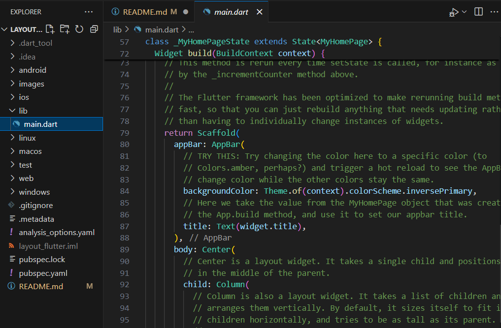

### Langkah 2: Buka file lib/main.dart
Buka file main.dart lalu ganti dengan kode berikut. Isi nama dan NIM Anda di text title.
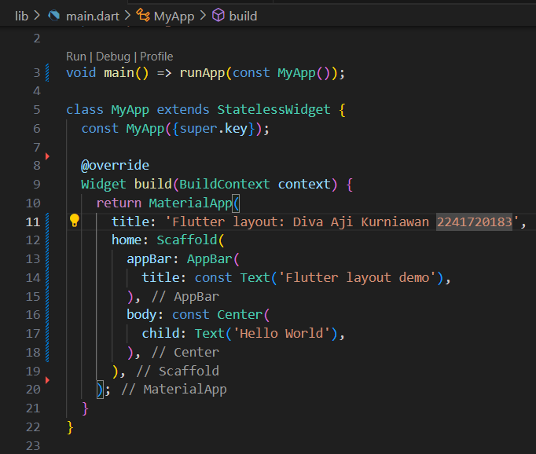

### Langkah 3: Identifikasi layout diagram
### Langkah 4: Implementasi title row
Membuat kolom bagian kiri pada judul. Tambahkan kode berikut di bagian atas metode build() di dalam kelas MyApp:
```
Widget titleSection = Container(
  padding: const EdgeInsets.all(...),
  child: Row(
    children: [
      Expanded(
        /* soal 1*/
        child: Column(
          crossAxisAlignment: ...,
          children: [
            /* soal 2*/
            Container(
              padding: const EdgeInsets.only(bottom: ...),
              child: const Text(
                'Wisata Gunung di Batu',
                style: TextStyle(
                  fontWeight: FontWeight.bold,
                ),
              ),
            ),
            Text(
              'Batu, Malang, Indonesia',
              style: TextStyle(...),
            ),
          ],
        ),
      ),
      /* soal 3*/
      Icon(
       ...,
        color: ...,
      ),
      const Text(...),
    ],
  ),
);
```

**soal 1**  
Letakkan widget Column di dalam widget Expanded agar menyesuaikan ruang yang tersisa di dalam widget Row. Tambahkan properti crossAxisAlignment ke CrossAxisAlignment.start sehingga posisi kolom berada di awal baris.
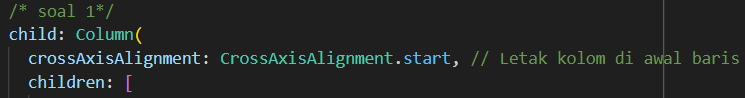

**soal 2** 
Letakkan baris pertama teks di dalam Container sehingga memungkinkan Anda untuk menambahkan padding = 8. Teks ‘Batu, Malang, Indonesia' di dalam Column, set warna menjadi abu-abu.
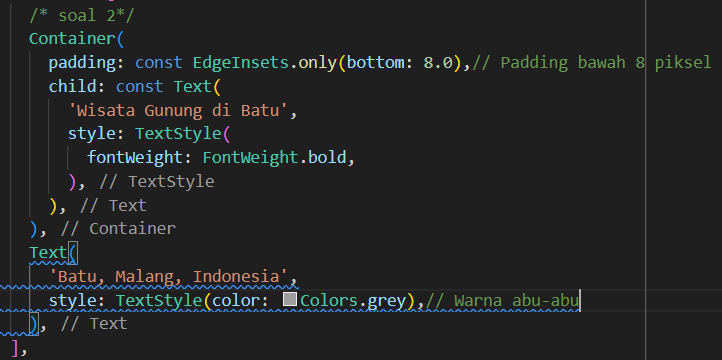

**soal 3** 
Dua item terakhir di baris judul adalah ikon bintang, set dengan warna merah, dan teks "41". Seluruh baris ada di dalam Container dan beri padding di sepanjang setiap tepinya sebesar 32 piksel. Kemudian ganti isi body text ‘Hello World' dengan variabel titleSection
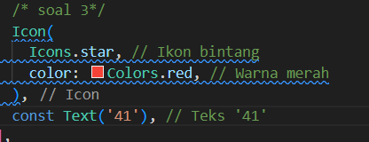
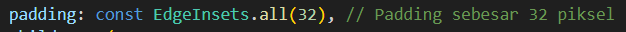
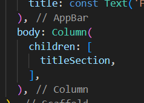

### Output Praktikum 1
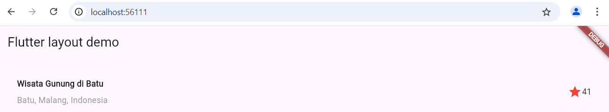

## Praktikum 2: Implementasi button row
### Langkah 1: Buat method Column _buildButtonColumn
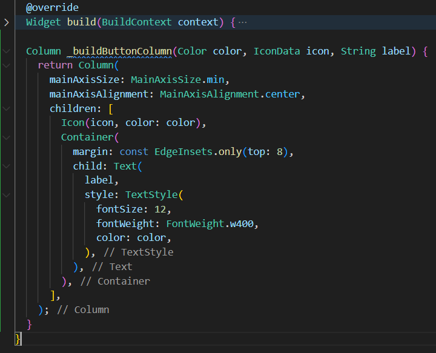

### Langkah 2: Buat widget buttonSection
Buat Fungsi untuk menambahkan ikon langsung ke kolom. Teks berada di dalam Container dengan margin hanya di bagian atas, yang memisahkan teks dari ikon.
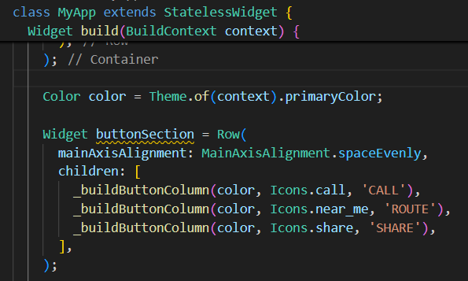

### Langkah 3: Tambah button section ke body
Tambahkan variabel buttonSection ke dalam body seperti berikut:
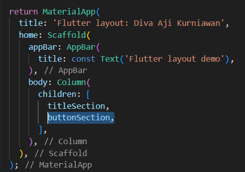

### Output Praktikum 2
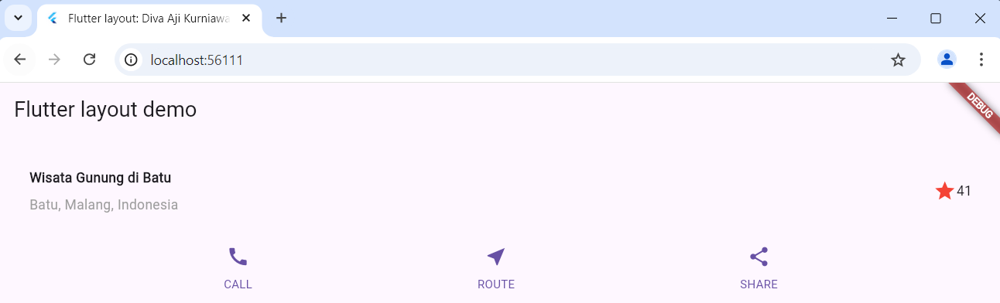

## Praktikum 3: Implementasi text section
### Langkah 1: Buat widget textSection
Tentukan bagian teks sebagai variabel. Masukkan teks ke dalam Container dan tambahkan padding di sepanjang setiap tepinya. Tambahkan kode berikut tepat di bawah deklarasi buttonSection:
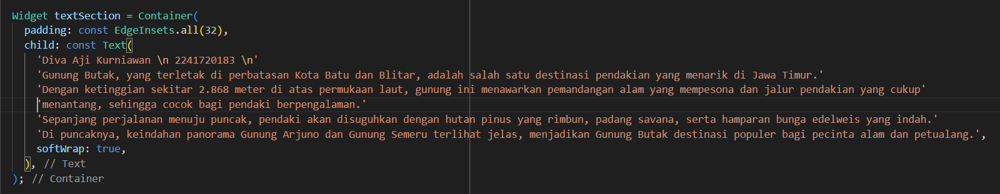

### Langkah 2: Tambahkan variabel text section ke body
Tambahkan widget variabel textSection ke dalam body seperti berikut:
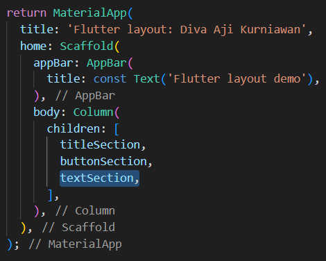

### Output Praktikum 3
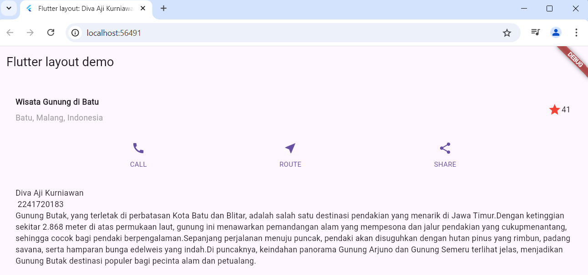

## Praktikum 4: Implementasi image section
### Langkah 1: Siapkan aset gambar
Buatlah folder images di root project layout_flutter. Masukkan file gambar tersebut ke folder images, lalu set nama file tersebut ke file pubspec.yaml seperti berikut:
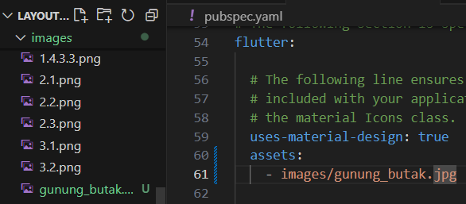

### Langkah 2: Tambahkan gambar ke body
Tambahkan aset gambar ke dalam body:
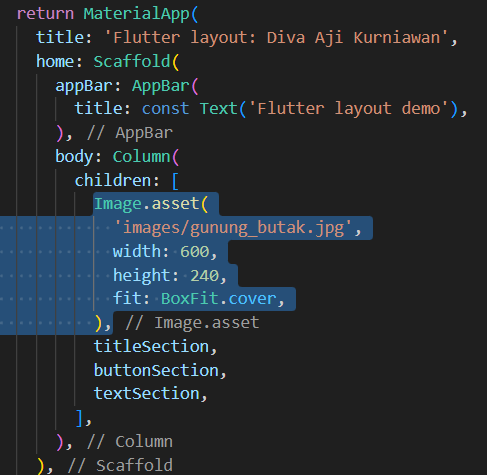
BoxFit.cover memberi tahu kerangka kerja bahwa gambar harus sekecil mungkin tetapi menutupi seluruh kotak rendernya.

### Langkah 3: Terakhir, ubah menjadi ListView
Pada langkah terakhir ini, atur semua elemen dalam ListView, bukan Column, karena ListView mendukung scroll yang dinamis saat aplikasi dijalankan pada perangkat yang resolusinya lebih kecil.
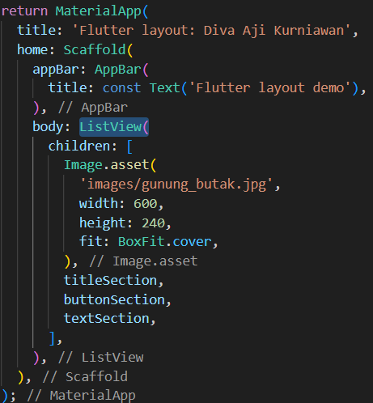

### Output praktikum 4
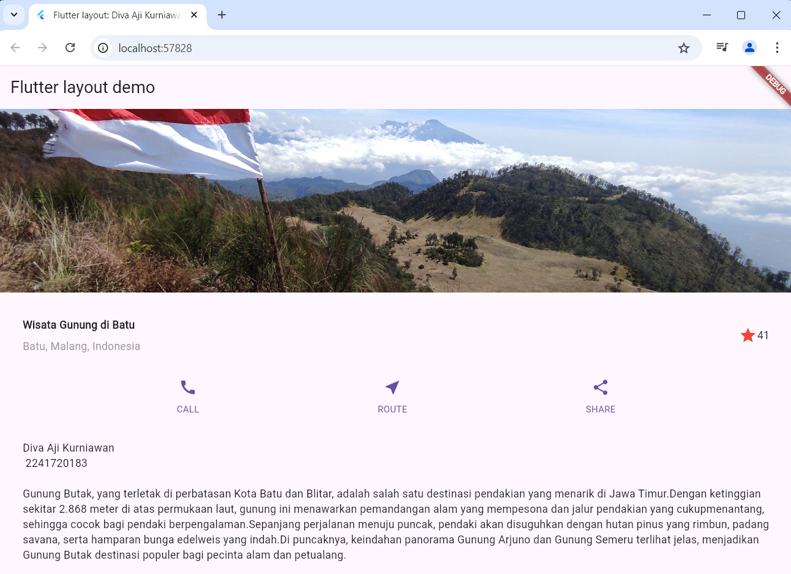

## Praktikum 5
Link repo github: https://github.com/DivaAji/belanja

### Langkah 1: Siapkan project baru
Sebelum melanjutkan praktikum, buatlah sebuah project baru Flutter dengan nama belanja dan susunan folder seperti pada gambar berikut. Penyusunan ini dimaksudkan untuk mengorganisasi kode dan widget yang lebih mudah.
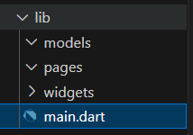

### Langkah 2: Mendefinisikan Route
Buatlah dua buah file dart dengan nama home_page.dart dan item_page.dart pada folder pages. Untuk masing-masing file, deklarasikan class HomePage pada file home_page.dart dan ItemPage pada item_page.dart. Turunkan class dari StatelessWidget.


### Langkah 3: Lengkapi Kode di main.dart
Setelah kedua halaman telah dibuat dan didefinisikan, bukalah file main.dart. Pada langkah ini anda akan mendefinisikan Route untuk kedua halaman tersebut. Definisi penamaan route harus bersifat unique. Halaman HomePage didefinisikan sebagai /. Dan halaman ItemPage didefinisikan sebagai /item. Untuk mendefinisikan halaman awal, anda dapat menggunakan named argument initialRoute.
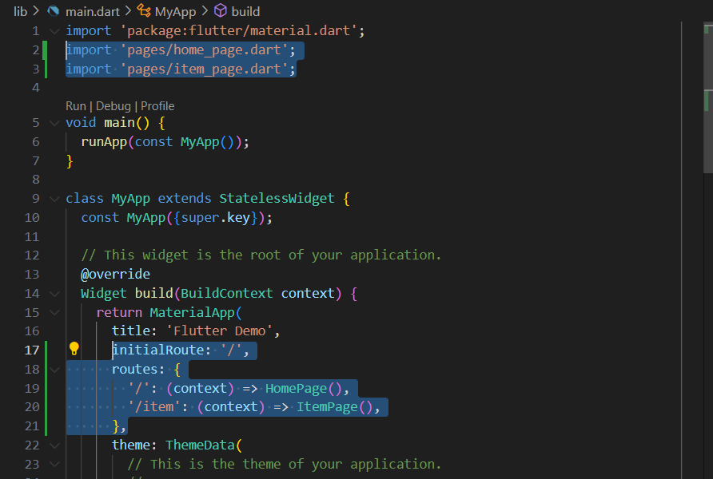

### Langkah 4: Membuat data model
Sebelum melakukan perpindahan halaman dari HomePage ke ItemPage, dibutuhkan proses pemodelan data. Pada desain mockup, dibutuhkan dua informasi yaitu nama dan harga. Untuk menangani hal ini, buatlah sebuah file dengan nama item.dart dan letakkan pada folder models. Pada file ini didefinisikan pemodelan data yang dibutuhkan.
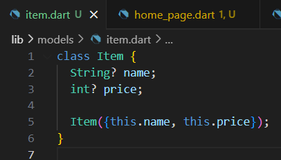

### Langkah 5: Lengkapi kode di class HomePage
Pada halaman HomePage terdapat ListView widget. Sumber data ListView diambil dari model List dari object Item. 


### Langkah 6: Membuat ListView dan itemBuilder
Untuk menampilkan ListView pada praktikum ini digunakan itemBuilder. Data diambil dari definisi model yang telah dibuat sebelumnya. Untuk menunjukkan batas data satu dan berikutnya digunakan widget Card.
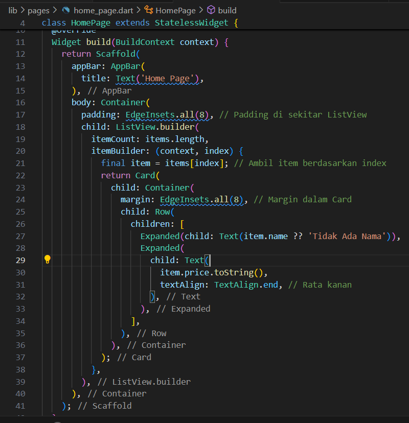

### Langkah 7: Menambahkan aksi pada ListView


### Output praktikum 5
Setelah dilakukan beberapa modifikasi. Hasilnya sebagai berikut:
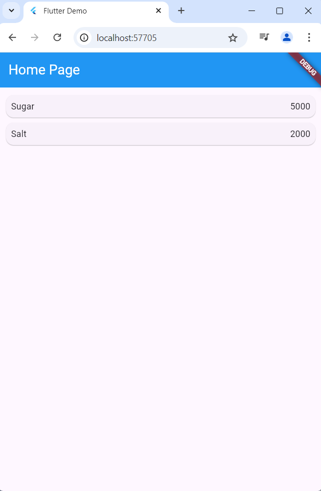
